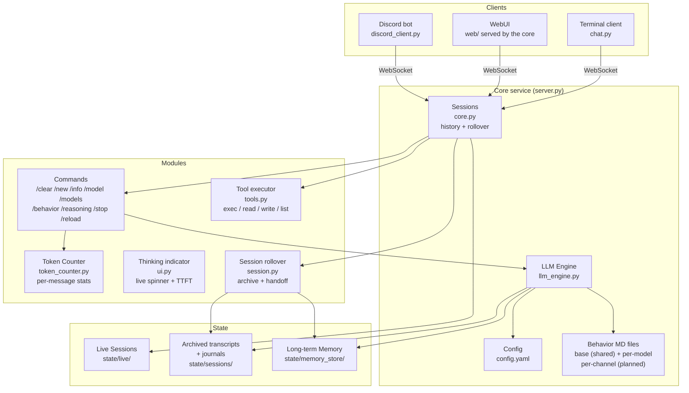
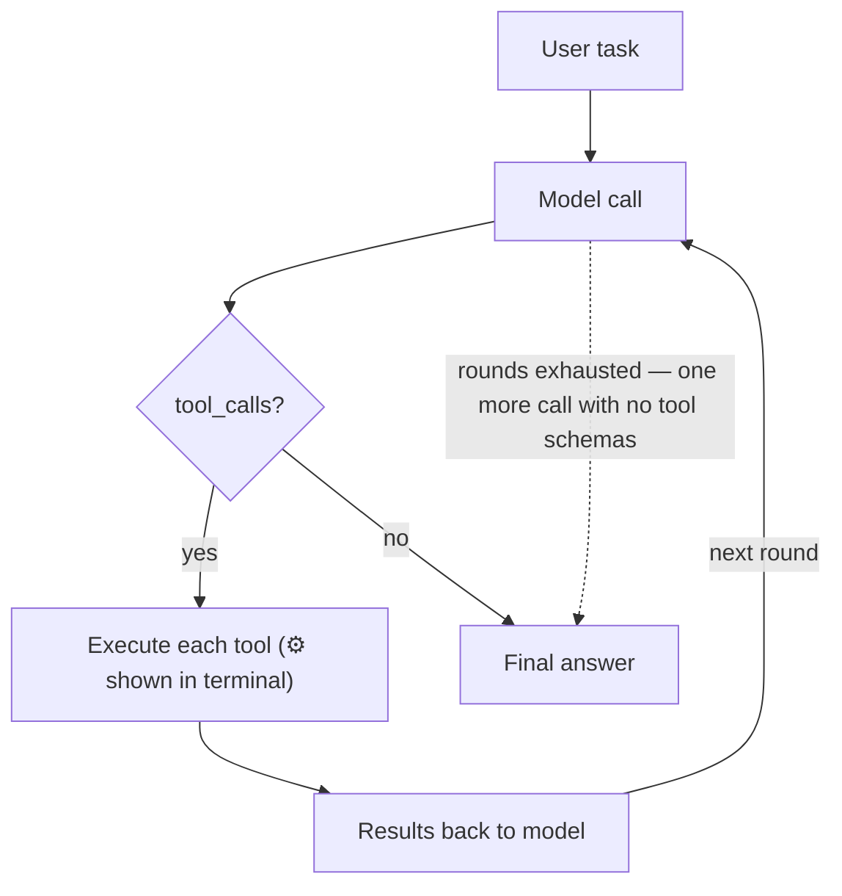
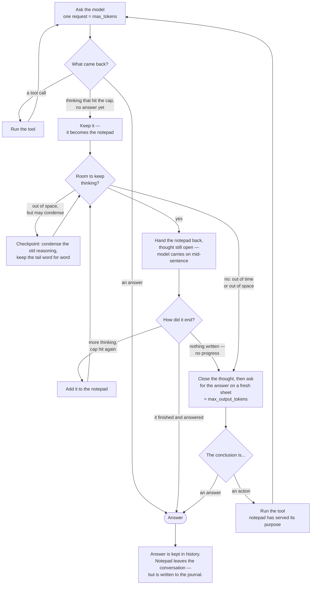

# letsClaw — Low Energy Agent Engine

A stripped-down agent: a long-lived **core service** holding the conversations, and
thin clients — a terminal REPL and a browser UI — that attach to it over a WebSocket.
Behavior is plain MD files — everything visible, nothing hidden.

## Philosophy Haha
- Simple: one config file, MD files for behavior
- Modular: base modules always-on, feature toggles in config
- Transparent: full source access, no black boxes
- Low energy: minimal footprint, no bloat
- Lean context: no hidden token injection — the context is your MD files + conversation, nothing else

## Quick Start

```bash
cd ~/letsClaw
python3 -m venv .venv
.venv/bin/pip install -r requirements.txt   # openai, pyyaml, aiohttp, tiktoken

./serve.sh                               # 1. the core — start this first, leave it running
./terminalUI.sh                          # 2. the terminal client, in another shell
```

`./serve.sh` also starts the **Discord bot** when `discord.token` is set, and says so
and carries on when it is not — so it stays the right command either way. Ctrl-C stops
both.

They all pass their arguments straight through:

```bash
./serve.sh --config other.yaml --bind 0.0.0.0 --port 9000
./serve.sh --no-discord                    # the core on its own
./terminalUI.sh -s daq-notes               # attach to a session other than 'terminal'
./terminalUI.sh --url http://lab-box:8770  # a core on another machine
./run_discord.sh --core ws://lab-box:8770  # a bot by itself, pointed at a core elsewhere
```

…or open <http://127.0.0.1:8770/> for the same thing in a browser. The WebUI is
served by the core itself — no build step, no `npm install`, no CDN, so it works on
a machine with no route to the internet.

The core holds the conversations; the terminal and the WebUI are just windows onto
them. It keeps running when you close them, and nothing works without it.

## Architecture



**Data flow:**
- **Core (`server.py` + `core.py`):** holds named sessions — history, model, rollover
  state, tools. Runs turns and emits events. Knows nothing about terminals.
- **Clients:** attach to a session by name over `ws://host:port/ws?session=<name>`.
  Several may attach to the same session and all see the same stream.
- **`chat.py`** is the reference client: it renders events and sends `submit` /
  `command` / `rollover_reply` / `stop`.
- **`web/`** is the same client in a browser, speaking the same protocol.
- **`discord_client.py`** is the same client again, with Discord on the far side:
  one socket per active channel, and nothing the core does not already hold.
  The core never imports `discord.py` and does not know it exists.

### Repo layout

```
letsClaw/
  serve.sh                 the core          — start this first; also starts the bot
  terminalUI.sh            the terminal client
  run_discord.sh           the Discord bot on its own (serve.sh usually starts it for you)
  config.yaml              your settings (gitignored — it holds API keys and the bot token)
  config.example.yaml      the documented template to copy from
  models/                  behavior Markdown: base.md + per-model
  web/                     browser client: index.html, app.js, style.css
  source/                  all Python
    paths.py                 where the repo root is — one definition
    server.py  core.py       the core service and the session logic
    chat.py    ui.py         the terminal client
    discord_client.py        the Discord client
    chunker.py               splitting an answer into messages Discord accepts
    llm_engine.py            talking to the model server
    session.py               persistence, archives, rollover handoffs
    tools.py  token_counter.py
  state/                   live conversations + archived transcripts and journals (gitignored)
  logs/                    (gitignored)
```

Two things worth knowing about this shape:

- **The scripts stay at the root and the code lives in `source/`.** `serve.sh`
  runs `source/server.py`, which puts `source/` on the import path, so the modules
  import each other by plain name (`import core`) with no package machinery.
- **Everything the code reads is at the root, not beside it** — config, `models/`,
  `web/`, `state/`, `logs/`. `source/paths.py` holds the single definition of
  where the root is (`REPO_ROOT`) and a `resolve()` for config paths, which are
  taken as-is when absolute and root-relative otherwise. Anything needing a repo
  path should use those rather than computing its own from `__file__`.

## Terminology

These words appear throughout this README, in the progress notices during a
turn, and in the code. They nest, largest first.

### Session, turn, round

| word | means | how many |
|---|---|---|
| **session** | one named, persistent conversation — its history, model and settings. `chat-1`, `discord-…`. Survives restarts. | lives until deleted |
| **turn** | one thing you asked → one answer you got back. Starts at `turn_start`, ends at `turn_end`. | many per session |
| **round** | one request to the model server, and its reply. | **one or many per turn** |

A **round** and a **request** are the same thing seen from two sides: a round is
one question-and-answer with the model, a request is the HTTP call carrying it.
The README says "round" for the unit of work and "request" when the network
matters.

The important one is that **a turn is not a round**. A simple question is one
turn, one round. A question that needs a file read, some thinking, and an answer
is still *one turn* — but five or six rounds.

### The kinds of round

All of these are rounds. They differ in what the model is being asked for:

| kind | what it is | what caps it |
|---|---|---|
| **first round** | the opening request of a turn | `max_tokens` |
| **tool round** | a round that came back asking to run a tool | `max_tokens` |
| **resume round** | *continues* a thought that ran out of room — the notepad handed back, still open | `max_tokens` |
| **checkpoint round** | condenses a full notepad so thinking can continue | `max_output_tokens` |
| **closing round** | the last one: the thought is shut and the model writes the reply | `max_output_tokens` |

There is **no budget on resume rounds.** The model may take as many as it needs;
what stops it is time, context, or having nothing more to say. See
[When does the thinking stop?](#when-does-the-thinking-stop).

You will see them counted in the live notices:

```
reasoning cut off — resuming it (round 2, pad ~320 tok)
```

The number is how many resumes this turn has taken so far — a progress
indicator, not a countdown.

### The paper

| word | means |
|---|---|
| **notepad** (or **pad**) | everything the model has thought so far this turn, accumulated across resume rounds. Lives in memory for one turn, never joins the conversation. |
| **answer sheet** | the separate allowance for the final reply — `max_output_tokens`. |
| **checkpoint** | the model's own note of what it has established, written when the notepad fills up, replacing the older reasoning. |

### Limits

| word | means |
|---|---|
| **wall** | a limit that stops the thinking: time, or context. Whichever hits first, the answer still gets written. |
| **rollover** | the *conversation* outgrew the model's window, so it is archived and restarted from a summary. One level up from a checkpoint, which is the same idea applied to a single turn's notepad. |
| **context window** | `context_length` — the total the model can hold at once: conversation **plus** notepad **plus** the reserved answer sheet. |

### Wiring

| word | means |
|---|---|
| **transport** | how this server is asked to resume a thought — `chat` or `raw`. See [Which servers can do this](#which-servers-can-do-this). |
| **client** | a terminal, browser or bot attached to a session. Several can watch the same one. |
| **event** | one message from core to client — `text`, `reasoning`, `notice`, `tool_call`, `turn_end`… |

## Behavior Files

The system prompt is assembled from three parts, in this order:

1. **Base behavior** — `models/base.md` (config: `behavior.base_file`), shared by every
   session and every model: the identity, the working style, and the tool notes. It is
   plain Markdown, so all of it can be tuned without a code change. A missing base file
   is a warning at core startup and an empty base — the core keeps running, the same
   behavior as a missing per-model file.
2. **Per-model behavior** — one MD file per model entry via `behavior_file`
   (e.g. `models/default.md`), layered on top of the base for tuning a specific LLM.
3. **Continued session** — after a rollover, the model-written handoff and the path of
   the previous window's [journal](#the-journal), with the grep commands for searching
   it, carried in the system message.

The prompt is not frozen at startup: it is rebuilt when a session switches models, rolls
over, or takes a config reload — which is also how a changed base or model file reaches a
running session. Per-channel behavior — a Discord channel with its own MD file on top of
the base — is not built: behavior is resolved per model today, not per session.

No framework-injected boilerplate: if it's not in the files above or the conversation,
it's not sent.

### What the base file commits the model to

`models/base.md` is not just an identity blurb — several of its rules are load-bearing,
and two directives in it are lifted out by the core and used as machinery.

| section | what it does |
|---|---|
| **How you work** | check with a tool rather than answer from memory; **decide rather than ask**; finish the whole task before answering |
| **Tools** | how to read a large file — `grep -n` then `sed -n`, because `read_file` has no offset and truncates |
| **Earlier windows** | search the previous window's [journal](#the-journal) before re-investigating anything |
| `## Checkpoint` | the text sent when a full notepad is about to be compacted — extracted by `extract_checkpoint_directive` |
| `## Forced conclusion` | the text sent when a server cannot resume a cut-off thought — extracted by `extract_conclude_directive` |

The **decide rather than ask** rule is the one to know about. Faced with a fork —
two designs, two libraries, two readings of your request — the model is told to
investigate both with tools, pick one, and say in its answer which it picked and
why it rejected the other. It asks you only when proceeding would destroy data or
cost money, or when the missing fact exists nowhere a tool can reach.

This matters because **a question ends the turn.** The agent loop runs while the
model calls tools; the moment it emits text instead, the turn is over — and the
core cannot tell a finished answer from *"shall I do A or B?"*. Nothing in the
reasoning machinery catches that case, so if you want the model to stop asking
and start deciding, this file is the only lever. Edit it and `/reload`.

## Agent Tools

The model can call tools to act on the real environment. Each turn, the agent
loop runs until the model gives a plain answer:



Built-in tools: `exec` (shell), `read_file`, `write_file`, `list_dir`.
Add a tool: define a `Tool(name, description, json_schema, async_handler)`
entry in `tools.py` and list its name in `tools.allow`.

All tool I/O is truncated (`max_output_chars`) so a single call can't blow
up the context, and the three file tools do their reading and writing off the event
loop — in the shared core one slow read would otherwise stall every session's stream.

The loop is capped at `tools.max_iterations` **rounds** per turn — a round is one model
call plus every tool call it returns, so one round can run several tools. At the cap the
core makes one final call with no tool schemas, so the model must answer in plain text.
Rollover is only evaluated *after* the loop fully drains, so a high cap means a runaway
model keeps looping — one full LLM call per round — until the server rejects an
over-window prompt or you send `/stop`.

`exec` runs in `tools.workdir` (default: the letsClaw directory itself). This matters
now that the core is a daemon: its own cwd is wherever `./serve.sh` was launched from,
which is not the shell you were sitting in, so relative paths need a stated base. Each
command gets **its own process group**, so a timeout — or a `stop`, or a core shutdown —
kills the children too instead of leaving a detached shell behind.

## Context Rollover

A conversation that outgrows the model's window gets rejected by the server. Rather
than silently dropping the oldest turns, letsClaw rolls the session over once it
passes `rollover_at_percent` of the active model's `context_length`:

1. the message list is archived to `state/sessions/<session>_<timestamp>.json`,
   and the journal segment beside it — see [The journal](#the-journal) — is closed
2. the model writes a handoff — objective, what's established, **what was ruled out**,
   what's still open — appended to `memory.long_term_file`
3. a fresh window starts from that handoff plus the last exchange verbatim, and is
   told to **grep the journal** for anything the handoff does not answer

The **RULED OUT** section is not decoration. A dead end is neither a settled fact
nor outstanding work, so without a section of its own it survives nowhere — and
the fresh window walks straight back into an approach the old one had already
eliminated. Losing a fact costs a re-derivation; losing a rejection costs a loop.
It is the same rule as the `## Checkpoint` directive in `base.md` ("every approach
you ruled out and why"), applied one level up.

The handoff is the *entire* memory of everything before the rollover, so it is
also what the summariser is given room for. Three caps apply, smallest wins:

| cap | value | why |
|---|---|---|
| `HANDOFF_MAX_TOKENS` | 1500 | four sections do not fit in less |
| a share of the window | `context_length / 20` | on a small model a fixed 1500 would be a permanent tax on the context it exists to save |
| what is free right now | `context_length − used − 200` | below `HANDOFF_MIN_TOKENS` (256) the summary is skipped and the last exchange is carried alone |

At 100k and above the absolute cap binds and you get the full 1500; only a
small-window model is scaled back.

For the same reason the summariser is shown each tool call's **arguments**,
clipped to 200 characters. Names alone would say that a search returned nothing
without saying what was searched for — which is exactly the sentence RULED OUT
needs to be able to write.

`rollover_mode` picks the behaviour: `auto` rolls over and says so, `ask` prompts
first, `off` only warns. **`/new` forces a rollover at any time**, in any mode — and
unlike `/clear`, which discards the conversation, `/new` files it and carries the
thread forward.

There is a second, earlier trigger. A window that is nearly full still has room for
one more exchange, but none to *think* in — so a thinking model would have its
reasoning squeezed out exactly where a hard question needs it (see
[Reasoning](#reasoning-the-notepad-and-the-answer-sheet)). With
`rollover_before_think` the core rolls over *before* such a turn rather than after
one that was already degraded. Auto mode only: `ask` must not put a question before
the turn has even started, and `off` means off.

Two directories under `state/`, easily confused: **`state/live/` is the conversation
you are having** — rewritten as you go and reloaded at startup — while
**`state/sessions/` is the archive**, a write-once record of a window that filled up.
A rollover writes to the second and starts the first over.

Archives are named `<session_id>_<session>_<timestamp>.json`, stamped at the
moment of the rollover:

```
a3f91c2e_letsClaw_2026-09-22T15-22-35.json
a3f91c2e_daq-notes_2026-09-22T16-04-11.json     ← same conversation, renamed
ff052414_scratch_2026-09-22T16-40-02.json       ← a different one
```

The **id leads because it is the half that cannot change.** A session can be
renamed, so grouping by name scatters one conversation across two prefixes,
while `ls a3f91c2e_*` finds every archive of it whatever it was called at the
time. The name is still there because an id alone tells you nothing at a glance,
and the timestamp sorts within a conversation. Nothing parses the name — it is
for you, not the code.

The name is not disambiguated. Two rollovers of one session inside the same
second write the same filename and the later one wins; that needs a rollover
whose handoff never runs (the model server unreachable, or no headroom left to
summarise), and is accepted rather than guarded against.

### The journal

Beside each `.json` archive sits a `.md` **journal** with the same name. They are
not two copies of one thing. The JSON is the *message list*, and two things are
missing from it that cannot be added afterwards:

- **the reasoning.** The core never puts it in history — not between tool rounds,
  not at the end of a turn, and least of all the thinking pad, which by design
  lives in `_think_pad` and nowhere else. None of it is in the archive because
  none of it was ever in the list being archived.
- **the full tool output.** `role="tool"` messages are clipped to
  `max_output_chars` (8000) before they enter history, middle elided. A 300 KB
  grep result is archived as its first and last 4000 characters.

So a window that has rolled over could see what the previous one *concluded* but
not what it *did* — and re-did it. The journal is the other half: written as the
turn runs, one block per round, holding every round's reasoning, every tool call
and every tool result **untruncated**.

```
## turn 12 user  [16:03:58]
## turn 12 round 1 reasoning  [16:04:02]
## turn 12 round 1 tool_call exec call_a1b2  [16:04:02]
## turn 12 round 1 tool_result exec call_a1b2 41822 chars  [16:04:09]
## turn 12 resume 4 reasoning  [16:07:31]      ← a thinking pad, kept at last
## turn 12 closing 5 text  [16:08:02]
```

**It is Markdown, not JSON, because of who reads it.** Nothing loads it back into
a conversation; its readers are you at a shell and the model itself. And the
model cannot use `read_file` on a file this size — that tool has no offset
argument and truncates at `max_output_chars`, so a 400 KB archive comes back as
2% of itself with the middle replaced by a marker. Telling a model to `read_file`
something it can only ever see a fraction of is worse than telling it nothing: it
looks, sees an elision, and concludes the detail is not there. One header per
line, on the other hand, is reachable at any size:

```bash
grep -n '^## turn'      state/sessions/a3f91c2e_letsClaw_*.md   # contents
grep -n 'tool_call exec' state/sessions/a3f91c2e_letsClaw_*.md  # every command run
sed -n '820,900p'        state/sessions/a3f91c2e_letsClaw_*.md  # read one block
```

That is exactly what the carryover block in the new window's system prompt tells
the model to do, and what the `## Earlier windows` rule in `base.md` tells it to
do *before* starting any investigation the handoff does not already answer.

The segment is stamped at its **first write**, not at construction, so a session
nobody speaks in leaves nothing behind; a rollover closes it and the next turn
opens the next one. Unlike the JSON archive the name *is* disambiguated with a
`-2` suffix — a rollover closes one segment and opens the next within the same
second as a matter of course, and a collision here would not overwrite the closed
segment but silently append the new window to the end of it.

Writes never raise. Losing the record is worth a log line, never a turn, and one
failure closes the segment rather than warning once per block forever. Set
`conversation.journal: false` to switch it off; `journal_max_block_chars`
(default 1,000,000) caps a single block so that one runaway `cat` costs a
megabyte rather than the volume.

Every session carries a **`session_id`** — 8 hex characters, minted once, stored
in its live file, unchanged by a rename. It leads the transcript filename, and
it is also written inside each transcript and into `state/sessions/index.jsonl`,
one JSON object per line:

```json
{"t":"archive","id":"a3f91c2e","name":"letsClaw","file":"a3f91c2e_letsClaw_2026-09-22T15-22-35.json","at":"…","model":"qwen38-local","messages":142}
{"t":"journal","id":"a3f91c2e","name":"letsClaw","file":"a3f91c2e_letsClaw_2026-09-22T15-22-35.md","at":"…","model":"qwen38-local","blocks":387}
{"t":"rename","id":"a3f91c2e","from":"letsClaw","to":"daq-notes","at":"…"}
{"t":"archive","id":"a3f91c2e","name":"daq-notes","file":"a3f91c2e_daq-notes_2026-09-22T16-04-11.json","at":"…","model":"qwen38-local","messages":98}
```

With the id in the filename, the everyday lookup needs no index at all:

```bash
ls state/sessions/a3f91c2e_*                            # every archive, either name
grep '"id":"a3f91c2e"' state/sessions/index.jsonl       # …plus when it was renamed
```

The index earns its place for what filenames cannot show: **a rename leaves no
file**, so without the `rename` records a conversation that was renamed between
two rollovers has a gap in its story. It also carries message counts, the model
in use, and exact timestamps, so you can survey a session without opening a
megabyte of JSON.

JSON Lines rather than a JSON document, for three reasons: an append never
rewrites what is already there, so two sessions archiving at the same moment
cannot lose each other's entry; a torn write costs one line instead of the file;
and it is greppable from the shell, which is how it is meant to be used.

#### `logs/session_ID.log` — the registry of ids in use

Tab-separated, one line per live session, rewritten in full on every change:

```
# session_id	name	created
dbdb9e23	system	2026-09-22T15:46:30
e19e3855	solaris daq	2026-09-22T15:46:30
3d523676	letsClaw	2026-09-22T15:46:30
```

Tabs rather than spaces because session names contain them (`solaris daq`), and
rewritten rather than appended because an id has to be able to *leave* — the file
holds one short line per session, so there is nothing to gain by being cleverer.

It does two jobs:

- **Minting checks it.** 32 random bits already collide about once in 4.3 billion;
  the registry is what turns that into *cannot happen*, which is worth having
  because a collision would be silent — two conversations sharing an archive
  prefix, with nothing to complain about it.
- **It says what each id is.** A rename updates the name in place and keeps the
  original creation time, so the registry never points at a conversation by a
  name it no longer answers to.

A deleted session's id is removed, returning it to the pool. Its archives keep
that id in their filenames — deleting a live conversation is not a claim that it
never existed — and with 32 bits the chance of a future session drawing the same
id and landing beside them is negligible.

A live session file written before ids existed has none; it is assigned one at
the next restart, registered, and persisted from then on.

The index is a convenience over the transcripts, never a dependency — if writing
it fails, the archive is still written and the failure only warns. `session_id`
was added to the live-file payload *without* bumping `LIVE_SCHEMA`, because a
bump makes `load_live` skip every file written before it; a session restored
from an older file keeps the id minted at startup and persists it on its next
save.

The trigger reads the server's own `usage.prompt_tokens`, so the percentage is exact.
Servers that withhold usage fall back to a local estimate, scaled up deliberately —
rolling over early costs a summary, rolling over late costs a rejected request. The
`~` in the stats line marks an estimated figure.

## Reasoning: the Notepad and the Answer Sheet

### The picture

Think of the model as a student at a desk with a **notepad** for working things
out and an **answer sheet** for the reply you actually see.

The awkward fact about a thinking model is that, left alone, it has only one
sheet of paper for both. It works out the problem, and it writes the answer, out
of the same allowance. Fill the sheet with working-out and you get no answer at
all — just a wall of half-finished thought and a `finish_reason=length`.

letsClaw gives it two separate things instead:

- a **notepad** it can keep writing on for as long as it needs
- an **answer sheet** that is kept aside, untouched, until the thinking is done

### How the notepad works

The catch is that a server will only ever generate `max_tokens` at a time. You
cannot ask for one enormous uninterrupted thought; it is a hard per-request
ceiling.

So the core does it in instalments. When a round fills its cap:

1. it keeps what was written (this is the part that used to be thrown away),
2. hands the whole pad back to the model with the thought still **open**, and
3. the model carries on from the exact word it stopped at — not from the
   beginning.

Each of those is a **resume round**, and you will see them in the progress
notices during a turn (`reasoning cut off — resuming it (round 2, pad ~320
tok)`). The notepad grows round by round, and because the thought is never
closed in between, it reads as one continuous piece of reasoning rather than
several restarts. You see it stream in live, exactly like a normal reply.

**There is no limit on how many resume rounds a turn may take.** The notepad is
effectively unbounded, and what ends it is a real constraint — the clock, the
context window, or the model having nothing left to add — never a count.

### How the answer sheet works

When the thinking has to stop, the core closes the thought itself by writing
`</think>`, and only then asks for the answer, under its own separate cap.

Closing it is doing two jobs at once. It guarantees the budget really is
separate — once the model is past that mark it *cannot* go back to thinking. And
it guarantees you get an answer at all: a model left inside an open thought will
very often just keep thinking and never come out on its own.

### Thinking room and answer room

These are the two budgets, and they are completely separate. That separation is
the whole reason the core closes the thought itself before asking for a reply.

```
thinking room  =  context_length − conversation − answer sheet − margin
                  (everything left over in the window)

answer room    =  max_output_tokens
                  (a fresh sheet, after the thinking is shut)
```

Note what is **not** in the first line: no setting caps the thinking directly.
The notepad simply grows into whatever the window has spare.

| setting | it is | it is **not** |
|---|---|---|
| `max_tokens` | how much one request may generate — a **chunk size** | a limit on how much the model may think in total |
| `max_output_tokens` | the size of the **answer sheet** | anything to do with thinking |
| `context_length` | the real ceiling on everything | per-request |

Worked through with your `qwen38-local` settings, on a short conversation:

| | |
|---|---|
| `context_length: 100000` | the whole window |
| − conversation (say ~2,000) | question, history, tool results |
| − `max_output_tokens: 32768` | the answer sheet, held back |
| − margin (2,000) | slack, since the token count runs low |
| **= thinking room** | **~63,000 tokens** |

At `max_tokens: 8192` that is roughly **eight** resume rounds — but eight is an
outcome, not a setting. Shrink the conversation and it rises; fill history with
tool results and it falls.

Three things this catches people out with:

- **Raising `max_output_tokens` does not buy more thinking** — it buys less.
  The answer sheet is subtracted from the window before the notepad gets any,
  so a bigger answer sheet means a smaller notepad.
- **`max_tokens` does not change how much the model can think**, only how many
  round-trips it takes to get there. Smaller chunks are not cheaper: the pad is
  re-sent every round, so halving `max_tokens` roughly **quadruples** the prompt
  tokens processed. Its real value is finer-grained wall checks.
- **Thinking room is a ceiling, not a reservation.** Nothing is pre-allocated;
  a simple question answers on the first round and costs one request.

See [When does the thinking stop?](#when-does-the-thinking-stop)



"Thrown away" means *out of the conversation*, not off the disk. Every round of
it — each resume, each checkpoint — is appended to the session's
[journal](#the-journal) as it happens, so a notepad that cost twenty minutes of
thinking is still greppable afterwards even though the next prompt has no trace
of it. The two are separate questions and the distinction matters: keeping the
pad on disk costs nothing, while keeping it in history would re-send it every
round and drag the rollover point forward.

### Can it use tools while thinking?

Not mid-thought, but yes at the end.

**Mid-thought, no.** There is nowhere to put the result. A conversation has no
way to say *"here is what `exec` returned — now carry on inside the sentence you
were halfway through"*. Calling a tool mid-thought would mean abandoning the
notepad, which is the one thing this whole mechanism exists to protect.

**At the end, yes.** By then the notepad has done its job: it worked out *what to
do*. If the model's conclusion is an action rather than a sentence, the tool
runs, and the turn carries on with the result in hand — thinking afresh from
there if it needs to. Same `max_iterations` limit as any other tool round.

Two safety rails:

- **A tool call that got cut off is never run.** Chopped-off arguments mean a
  chopped-off command, and `rm -rf /tmp/scratch` truncated to `rm -rf /` is the
  accident waiting to happen. The call is recorded as empty, the model is told it
  was cut short, and the turn continues.
- **On llama.cpp, tools are not offered at this stage at all**, because the
  endpoint used for resuming returns plain text and cannot report a tool call
  properly — you would just see raw `<tool_call>` markup. There the model is
  asked for words instead, and any markup that shows up anyway is stripped out.

### When does the thinking stop?

Three things can call time on it. Whichever comes first, the answer still gets
written — a turn never ends empty just because the thinking ran long.

| what runs out | the model stops thinking when |
|---|---|
| **time** | the turn has been going for `turn_timeout` minus `answer_time_reserve`, so there is still time left to write the answer |
| **space** | the notepad, the conversation so far, and the reserved answer sheet would together overflow the model's `context_length` |
| **ideas** | a round comes back having written nothing, or stops without hitting the cap — the model has finished thinking |

Note what is *not* on that list: a round count. There is no budget on how many
times a thought may resume, because a count is not a limit the machine actually
has. The first two are physics; the third is the model saying it is done.

"Space" needs one sentence of explanation: the whole notepad is re-sent to the
model on every round — that is *how* it remembers what it was thinking — so the
notepad takes up room in the context window while the turn is running.

The "ideas" row is also what stops the loop spinning. A round that hits the cap
having produced no reasoning cannot grow the pad, so the space wall would never
move and every further round would be identical; the core concludes instead.

### Making the notepad effectively unlimited

Of those three, only the space limit can be pushed back, and
`max_pad_compactions` pushes it.

When the notepad fills up, instead of stopping there the core asks the model to
write a **checkpoint**: a note of every figure it has worked out, every
assumption it made, and what is still to do. That note, plus the **last ~2,000
tokens kept word for word**, becomes the new notepad — and off it goes again
with room to spare. It is the same thing [Context Rollover](#context-rollover)
does for a conversation that fills its window: keep the meaning, drop the bulk.

Keeping that last bit word for word is the whole trick, not a detail. A summary
of where the model *was* cannot be carried on mid-sentence. So the older
reasoning gets condensed and the sentence it is actually in the middle of is
left alone.

Turn this on and thinking is limited by **time alone** — which is what the space
limit was really standing in for.

**It is off by default (`0`), on purpose.** Condensing loses detail, and for a
calculation that carries exact numbers through many steps, finishing from a
complete notepad usually beats carrying on from a summarised one — a lost
intermediate value gives you a wrong answer that looks perfectly reasonable.
Turn it up for work long enough that running out of room is the bigger risk.
Either way two guards apply: a checkpoint that comes back empty, or one that
fails to make the notepad any smaller, finishes from the notepad it already has
rather than looping. The wording is yours to edit, under `## Checkpoint` in
`models/base.md`.

### What the notepad costs afterwards

Nothing, in context. It lives in memory for the length of one turn and **never
becomes part of the conversation** — only the answer does. So a long think does
not bloat the history or bring a rollover forward.

It does not vanish, though. Each round of it is appended to the
[journal](#the-journal) as it is generated, which is the only record of it there
has ever been: before that, a notepad that filled the context and produced one
paragraph left nothing behind but the paragraph.

The reverse problem is handled too. A conversation that has nearly filled its
window still has room for one more exchange, but no room to *think* in — so with
`rollover_before_think` the core rolls over **before** such a turn, rather than
after one whose thinking got squeezed out. (Auto mode only; `ask` and `off` are
never interrupted before a turn starts.)

### The settings

| setting (per model) | default | what it does |
|---|---|---|
| `max_tokens` | — | **one instalment** — how much the model may write in a single request. A chunk size, not a thinking budget |
| `reasoning` | `true` | whether a cut-off thought is resumed at all (`false` turns the notepad off entirely) |
| `max_output_tokens` | `32768` | **the answer sheet** — the separate allowance for the final reply |
| `max_pad_compactions` | `0` | how many times a full notepad may be condensed so thinking can go on (`0` = stop and answer) |
| `turn_timeout` | `36000` | seconds one whole turn may take, thinking included (`0` = no limit) |
| `answer_time_reserve` | `120` | seconds of that held back so the answer still gets written |
| `resume_mode` | `auto` | how to resume a thought on this server — normally leave it alone |
| `reasoning_effort` | unset | how hard to tell the model to think, if its template supports it |

Rules of thumb: for **more thinking**, give the window more room — a shorter
conversation, a smaller `max_output_tokens`, or a bigger `context_length`. For
**fewer round-trips** covering the same thinking, raise `max_tokens`. For a
**longer final answer**, raise `max_output_tokens` (and accept slightly less
thinking room). For a **faster, shorter-thinking** model, lower
`reasoning_effort`.

> Worth checking on llama.cpp: `reasoning_effort` defaults to **`xhigh`** there,
> which quietly adds *"think carefully… validate key assumptions, consider
> plausible alternatives"* to every request. That alone causes a good share of
> the rounds that fill up without an answer. `medium` adds nothing at all.

`turn_timeout` also sets the network read timeout, because the client's own
600-second default would otherwise drop a long request at the socket before the
model had finished. If the wall is hit mid-request the turn is cancelled exactly
as `/stop` would do it — the conversation is repaired and saved.

### Which servers can do this

Resuming a thought means asking the server to *continue* a half-written reply
instead of starting a new one. Not every server exposes that, so
`resume_mode: auto` tests yours once and picks the right method:

| server | method |
|---|---|
| vLLM, SGLang | `continue_final_message` on the normal chat endpoint |
| llama.cpp | its raw `/completion` endpoint, with the prompt built by `/apply-template` — its chat endpoint ignores a half-written reply |

If a server can do neither (or you set `resume_mode: off`), the core falls back
to the old approach: it tells the model *"you ran out of room, answer now"* and
asks again from scratch. That throws the thinking away — it is exactly what the
notepad was built to avoid, so it is a fallback and nothing more.

## Token Counting

The `⚡` line after every turn carries three different numbers, and they answer
different questions:

| | |
|---|---|
| `user N + LLM N tok` | the sizes of the question and of the final answer |
| `out N tok` | **everything the model generated** this turn — the answer, the thinking, and the arguments of every tool call, summed across all rounds of the agent loop. This is what a metered endpoint bills |
| `context N/N` | how full the window is, i.e. what the *next* prompt will cost |

`out` is read from the server's `usage.completion_tokens`, and only when **every**
round of the turn reported one — a partial sum would look exact while missing rounds.
Otherwise it is a local estimate and carries a `~`, independently of the `~` on the
context figure: the prompt side and the output side can be measured or estimated
separately.

Beside it, `(N this session)` is a running total, also shown by `/info`. It is an
odometer, not a gauge: it counts what the session has ever generated, so `/clear` does
not rewind it and it comes back with the session after a restart. Deleting the session
is what resets it. A turn that still produces no answer — rare now that reasoning is
resumed rather than discarded, but possible if even the closing round comes back
empty — says what it spent anyway, so the cost is never invisible.

## The Core

Start `./serve.sh` once; clients come and go around it.

| | |
|---|---|
| `GET /health` | liveness + protocol version |
| `GET /models` | configured models |
| `GET /sessions` | live sessions: model, message count, attached clients, busy |
| `POST /sessions/<name>/rename` | `{"to": "..."}` — same conversation, different name |
| `DELETE /sessions/<name>` | forget one — the history is discarded, nothing is written |
| `POST /reload` | re-read `config.yaml` into the running core; `400` and no change if it will not load |
| `WS /ws?session=<name>` | the live stream |
| `GET /` , `GET /static/*` | the WebUI, from `web/` |

The socket takes four query parameters. `session` is the name to attach to,
created on demand. `last_seq` replays what was missed while detached.
`reasoning=0` withholds the thinking text for a client that will never draw it
(the Discord bot sets it; the running token count still comes through).
`model=<name>` picks the model **only when this attach is what creates the
session** — re-attaching never switches a live one, since that would move the
conversation out from under anyone else attached to it.

Client → core messages are `submit`, `command`, `rollover_reply`, `stop` and
`ping`. `submit` may carry an `origin` naming who is speaking, for a client
where the session name does not say: the Discord bot sends
`discord:<username>`, so one channel's shared session still records who typed.
It is clamped to 64 characters and falls back to the session name.

When `core.token` is set every route above needs it — as `Authorization: Bearer <token>`
or `?token=` — **except** `GET /health`, which stays open so a monitor can check
liveness without holding the secret, and the WebUI itself, which holds no secrets and is
the thing that asks for the token.

**Sessions** are created on demand by name — `terminal`, `discord-987654321098765432`,
whatever a client asks for. Each has its own history, model and rollover state; `/model` in one
does not disturb another, because engines are shared per model and never closed
underneath a session still using them.

**Sessions survive a restart.** Each one is written to `state/live/` as a single JSON
file after every turn and again on a clean stop, and reloaded before the first request
is served — so the sidebar is right on its very first paint, with no client having
attached yet. The file is replaced by an atomic rename, so a `kill -9` mid-write leaves
the previous good copy rather than a truncated one, and the most a crash can cost is the
turn that was still running. A half-finished turn is never written: an unanswered tool
call or an unanswered question is unwound before saving, so what comes back is always a
conversation you could pick up.

Nothing expires. A session stays on disk until you delete it, at which point its file
goes with it; renaming moves the file, and a name you attached to but never spoke in is
never written at all. `/clear` keeps the session and empties it, which is the difference
between throwing away a conversation and throwing away the session.

### Reloading config

`POST /reload`, the `/reload` command, or **♻️ reload** in the WebUI re-reads
`config.yaml` and applies it to everything already running — no restart, no dropped
socket, no interrupted turn.

**Nothing is committed until the new file parses and produces a working engine for every
model in it.** A half-finished edit — the normal state of a file open in an editor —
comes back as `400` with the parser's own complaint, and the core carries on exactly as
it was. Building the engines *is* the validation: it is the same code path a real turn
takes, so it catches a missing `base_url` that a schema check would wave through.

Three tiers:

| | |
|---|---|
| **Live already** | `core.token`, the `state/` paths, and the model list `GET /models` serves — these are read per request, so the reload is what updates the file, not what plumbs it through |
| **Reload picks it up** | **every setting in every model entry** — the engines are rebuilt from scratch, so `context_length`, `base_url`, `provider_name`, the sampling parameters, and all of the reasoning settings (`reasoning`, `max_tokens`, `max_output_tokens`, `max_pad_compactions`, `turn_timeout`, `answer_time_reserve`, `resume_mode`, `reasoning_effort`) come across; added and removed models; behavior files including `base.md`; the tool allowlist and `exec_timeout`; `max_iterations`; every `conversation.*` setting; `logging.level` |
| **Restart-only** | `core.bind` and `core.port` — the socket is already bound, and rebinding drops every client, which is the thing being avoided — and `logging.file` |

An idle session takes the change immediately; one mid-turn takes it the moment that turn
ends, and the reply says how many of each. **A setting a session changed for itself is
left alone** — the test is whether it still holds what the *old* config said, so a
session that auto-disabled its own rollover is not dragged back into the loop it just
escaped. A model deleted from the config does not move the sessions using it: they keep
the engine they have, which still works, and are told that `/model` can no longer return
to it.

The reply names what moved, key by key
(`models.qwen38-local.context_length: 100000 -> 128000`), so a reload says what it did
rather than just that it happened.

**Because the core outlives its clients**, closing the terminal mid-answer does not
stop the turn. Reattach and the output you missed is replayed, then the conversation
carries on. One turn at a time per session: a second submit is refused with `busy`
rather than silently queued behind a context its sender never saw.

**Events** (core → client): `hello` `turn_start` `text` `reasoning` `tool_call`
`tool_result` `stats` `turn_end` `rollover_start` `rollover_ask` `rollover_done`
`session_state` `notice` `busy` `error` `response` `pong`.
**Messages** (client → core): `submit` `command` `rollover_reply` `stop` `ping`.

There is no attach message: the session name is a query parameter on the socket, and
`hello` — the first event on every connection — carries the snapshot back. So attaching
is a connection, not a handshake, and reconnecting is the same operation as connecting.

`tool_call` is emitted *before* the tool runs, so a slow `exec` is visible instead of
silent. Read-only commands (`/info`, `/behavior`, bare `/model` and `/models`) come back as a
`response` to the asking client only, not broadcast to everyone attached.

> **Security.** Tools are unconfined by design: `exec` runs shell commands and
> `read_file`/`write_file` reach any path this process can. Anyone who can open a
> WebSocket to the core can therefore run commands on this machine. Keep `core.bind`
> on loopback, or set `core.token`, and only connect frontends you control.
>
> Note what the Discord bot does to that last sentence. It is a local process, so
> a loopback-bound core does not keep it out — it *bridges* the core to anyone who
> can send the bot a message, which by default is everyone on Discord. Running it
> means the allowlist in `discord.users`, not `core.bind`, is what stands between
> a stranger and a shell here. See [Discord Client](#discord-client).

## Terminal Client

`./terminalUI.sh` is a thin client: it renders events and sends `submit` / `command` /
`rollover_reply` / `stop`, and holds no conversation state of its own. Two flags —
`-s/--session` picks the session name (default `terminal`), `--url` points at a core
somewhere other than the `core.bind`/`core.port` in the config.

| command | |
|---|---|
| `/clear` | discard the conversation and start over |
| `/new` | archive the session, keep the objective, start fresh |
| `/model` , `/model <name>` | list the configured models, or switch this session to one |
| `/models` | the model list on its own |
| `/info` | session name and id, recent history, context usage, output total |
| `/behavior` | print the loaded behavior file |
| `/reasoning` | toggle live display of the model's thinking |
| `/stop` | interrupt the turn in progress |
| `/reload` | re-read `config.yaml` into the running core |
| `/quit` , `/exit` | leave — the core keeps running, and so does the turn |

**Tab completes** commands, and model names after `/model `. The completion list prints
each command with its description rather than a bare column of names. One gap to be aware
of: the completer's list (`COMMANDS` in `chat.py`) does not include `/models`, so `/models`
works when typed but is never suggested. `/quit`, `/exit`
and `/reasoning` are handled in the terminal — they change this window, not the
conversation — so they never reach the core; everything else is a `command` message and
comes back as a `response` to this client alone.

Readline needs a blocking read, so input runs on its own thread and is fed to the event
loop through a queue: the prompt stays editable while an answer streams in above it.

## WebUI

<http://127.0.0.1:8770/> — three static files (`index.html`, `app.js`, `style.css`),
served by the core. No framework, no build step, no CDN: the core often sits on an
isolated lab network, so everything the page needs comes from the core itself. Note the
`/static/` route serves the whole `web/` directory, so the test helpers (`test_md.mjs`,
`browser_test.py`, `shot.py`) are also reachable under it — harmless while the core is
loopback-bound, but something to keep in mind before exposing the port.

**The sidebar** on the left is the session list, rebuilt from `GET /sessions` rather
than tracked locally, so a session someone started in another window shows up here
too. Each row carries its message count, a dot while a turn is running, and `✎` and
`✕` on hover; `+` opens a name field, and switching to a name that does not exist yet
*is* how you create it — sessions spring into existence on attach. `☰` hides the list,
and `?session=<name>` still picks one from the URL.

`✎` (or a double-click on the name) **renames in place** — same session object, same
conversation, same socket; only the label moves. Anyone attached is told over their
own socket and follows it, URL included, so a reload lands on the same conversation.
Blank names, names containing `/`, and names longer than 64 characters are refused
(400), as is a name already in use (409). Like delete, it is refused while a turn is
running: every event is stamped with the session's name, so a rename mid-turn would
split one turn's output across two names. Transcripts already archived under `state/`
keep the old name in their filename — they record what the session was called then.

`✕` **discards the conversation and writes nothing**, so it asks first and tells you
how many messages are about to go. It is refused (409) while a turn is running, since
dropping the session out of the registry would not stop the turn. Anyone attached to a
deleted session keeps their socket: they get a notice, and their next message
transparently lands on a fresh, empty session of the same name. Past rollover
transcripts under `state/` are archives of their own and are left alone.

Everything the terminal client can
do is there: streaming answers with markdown and copyable code blocks, tool calls
appearing *before* they run, the context gauge with the rollover threshold marked,
the `🧠 think` toggle, the rollover prompt with its live countdown, and the same
slash commands with `/`-triggered autocomplete.

Two things worth knowing about how it behaves:

- **Nothing is rendered optimistically.** Your own message appears when the core
  echoes it back in `turn_start`, so every client attached to a session shows the
  same transcript in the same order — including yours.
- **It reconnects on its own** and replays the session history on attach, so closing
  the laptop mid-answer loses nothing.

If `core.token` is set the page asks for it before connecting. The page itself is
served unauthenticated on purpose: it holds no secrets, and it is the thing that
asks for the token.

**Tests.** `node web/test_md.mjs` exercises the markdown renderer headlessly.
`.venv/bin/python web/browser_test.py` drives real headless Chrome over the DevTools
Protocol against a running core — no Selenium, no Playwright, nothing to install —
and asserts against the live DOM, so a JS error that stops the render fails a check
rather than passing quietly. `web/shot.py <session> [out.png] [dark|light]` takes a
screenshot; both themes follow `prefers-color-scheme`.

## Discord Client

A client like the other two, in its own process. `./serve.sh` starts it alongside
the core whenever `discord.token` is set, so there is usually nothing separate to
run; `./run_discord.sh` starts one on its own, for a bot on a different machine
from its core, and `./serve.sh --no-discord` leaves it out.

The core never imports `discord.py` and does not know it exists; the bot holds one
WebSocket per active channel and translates between Discord messages and core
events. Restarting it costs nothing, because the session on the core's side *is*
the conversation.

> ⚠️ **A bot is a remote shell.** The tools are unconfined, so anyone who can get
> a message to this bot can run commands on the machine hosting the core. Anyone
> on Discord can DM a bot by default, and inside a guild the only wall is
> Discord's own channel permissions. So `discord.users` is a **required**
> allowlist of snowflake IDs: an empty list refuses everybody, which is the
> startup default rather than an oversight.

**Setup.** Make a bot at <https://discord.com/developers/applications> → New
Application → Bot. Copy its token into `config.yaml` under `discord.token`
(`config.yaml` is gitignored, so it stays put), and switch **Message Content
Intent** on under Privileged Gateway Intents — without it every message arrives
with empty text. Invite it with the `bot` scope and Send Messages + Read Message
History. Then put your own user ID in `discord.users` (Discord → Settings →
Advanced → Developer Mode, then right-click yourself → Copy User ID).

**One channel is one conversation.** Sessions are keyed on Discord snowflakes,
never on names, so renaming a channel keeps its conversation and two channels
that share a name never collide:

| where | session |
|---|---|
| guild channel | `discord-<channel_id>` |
| thread | `discord-<thread_id>` — its own conversation, not the parent's |
| DM | `discord-dm-<user_id>` |

`aliases` maps an id to a readable name for the WebUI sidebar; it changes the
label, not the identity. `channels: {<id>: {model: …}}` picks the model for a
channel, applied when that channel's session is first created — re-attaching
never switches an existing session, since that would move the conversation out
from under anyone else attached to it.

**Talking to it.** In a guild the bot answers when @mentioned or replied to
(`mention_only`, on by default — hygiene, so it stays quiet in a busy channel,
not a security control). DMs never need a mention. Every slash command the
terminal has works as a plain message: `/info`, `/model [name]`, `/models`,
`/new`, `/clear`, `/behavior`, `/stop`, `/reload`, plus a local `/help`.
`/reasoning` is answered but does nothing — this client asks the core not to
send the thinking at all (`reasoning=0`), so none of it crosses the wire.

**The answer arrives once, at the end.** Nothing is streamed: deltas are
buffered and posted on `turn_end`, which keeps the reader loop off the Discord
API so a slow Discord can never stall a turn. A typing indicator runs meanwhile.
The answer is then split by `chunker.py` — 2000 characters, a soft 17-line cap,
and fences closed and reopened so a code block never leaks into the next
message. Past `max_messages` (default 8) the opening chunks go out and the whole
answer follows as an `answer.md` attachment rather than forty messages.

**The rollover question** is posted like any other, and `yes`/`no` answers it —
addressed the normal way, so replying to the question works. Not answering
within `prompt_timeout` keeps the session, exactly as in the other clients. With
`mention_only: false` a bare "yes" in the channel can also answer it, which is
one more reason to leave it on.

**Idle channels are detached** after `idle_detach_min` (default 60) and
re-attached on the next message; the conversation is on the core, not here. The
link reconnects on its own with backoff and resumes by `last_seq`, so a core
restart mid-answer loses nothing.

**Tests.** `.venv/bin/python tests/test_chunk.py` covers the chunker (fences,
long lines, CJK, the 2000 boundary, italics), `tests/test_discord.py` drives the
gate, the routing and the rendering against fake Discord objects and a fake
link, and `tests/test_discord_live.py` spawns a real core on a temp config and
checks the protocol end to end — handshake, token, `?model=`, `origin`, and
reconnect-by-seq. None of the three needs a bot token or a network.

## Future Features

- **Semantic search** — embed past messages/sessions and search them by meaning, not just keyword match
- **Memory system** — read accumulated handoffs back in: rollover writes `state/memory_store/long_term.md`, but a new session is only seeded from its own predecessor, never from the whole history of the file
- **Per-channel behavior files** — a Discord channel with its own behavior MD on top of the base, rather than only the per-model one. Needs a small core change: behavior is resolved per model today, not per session
- **Discord draft streaming** — live-edited messages as the answer builds, instead of one post at `turn_end`

## Config

See `config.example.yaml` for full reference with comments.

**Key sections:**
- `models` — Registry of named models. Each entry is self-contained: its own `base_url` (required), `api_key`, exact server model ID (`provider_name`), behavior file, `context_length` and sampling parameters — so two models can live on two different servers with different window sizes, and reading one entry tells you everything about that model. `default_model` picks the model a new session starts on; `/model <name>` switches one session at runtime without disturbing the others.
- `core` — The service itself: `bind` (loopback by default — see the security note above), `port` (the WebUI is on the same one), and `token`, an optional shared secret. `--bind` / `--port` / `--config` on `./serve.sh` override the first three.
- `tools` — Agent tools: enable flag, allowlist, `max_iterations` (tool rounds per turn before a final answer is forced), `exec_timeout`, `max_output_chars`, and `workdir` — the base directory `exec` runs in and relative paths resolve against, defaulting to the letsClaw directory.
- `conversation` — `max_history_messages`, a backstop that trims the oldest messages (never opening on an orphaned tool result) and only applies on turns where no rollover happened — rollover is the real mechanism, this just stops an unbounded session with rollover switched off. Then rollover policy: `rollover_at_percent` (0 disables), `rollover_mode` (`auto`/`ask`/`off`), `prompt_timeout` (seconds to wait for an answer in `ask` mode before keeping the session). Two directories: `live_dir` holds the running conversations and is reloaded at startup, `sessions_dir` holds archived transcripts and the journal segments beside them. Then the journal itself: `journal` (default true — the `.md` record of every round's reasoning and every untruncated tool result, which is what stops a rolled-over window repeating work; see [The journal](#the-journal)) and `journal_max_block_chars` (default 1,000,000, the cap on one recorded block). The context window itself is per model, under `models`.
- `discord` — the Discord bot, and only ever read by it: `token` (the bot token), `core`/`core_token` (where the core is and its shared secret, both defaulting to the `core` section above), `users` — the **required** allowlist of snowflake IDs, empty meaning nobody — `mention_only`, `idle_detach_min`, `max_messages`/`max_lines` for how an answer is split, `aliases` for readable session names and `channels` for per-channel models. Omit the whole section if you do not want a bot. See [Discord Client](#discord-client) for the security note that goes with it.
- `memory` — `long_term_file`, where rollover handoffs accumulate
- `logging` — `level` and `file`; the core logs there and to stderr, and every session event of consequence (restore, rename, delete, rollover, a dropped tool-call turn) is one line in it.
