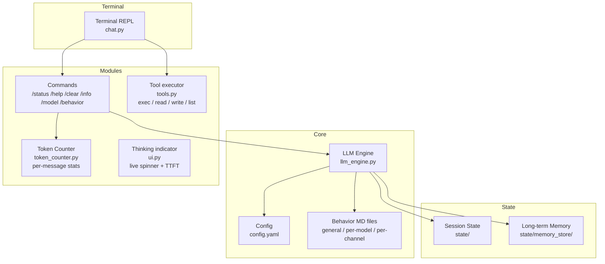

# letsClaw — Low Energy Agent Engine

A stripped-down, terminal-based agent with an interactive REPL (Read–Evaluate–Print Loop) chat.
Behavior is plain MD files — everything visible, nothing hidden.

## Philosophy Haha
- Simple: one config file, MD files for behavior
- Modular: base modules always-on, feature toggles in config
- Transparent: full source access, no black boxes
- Low energy: minimal footprint, no bloat
- Lean context: no hidden token injection — the context is your MD files + conversation, nothing else

## Quick Start

```bash
cd ~/letsClaw
pip install -r requirements.txt   # openai, pyyaml, aiohttp
python3 chat.py                   # interactive terminal chat
```

## Architecture



**Data flow:**
- **Terminal REPL:** `chat.py` is the single entry point — interactive chat with `/` commands for session control (Tab completes commands and model names), calls `llm_engine.py` for LLM chat.
- **Dotted lines = config/behavior files loaded at startup.**

## Behavior Files

Behavior is pure Markdown, layered (assembled into the system prompt at startup):

1. **General** — universal base behavior shared by all models
2. **Per-model** — tuning for a specific LLM (e.g. `models/default.md`)
3. **Per-channel** — overrides for a Discord channel (planned, with Discord)

No framework-injected boilerplate: if it's not in an MD file or the conversation, it's not sent.

## Agent Tools

The model can call tools to act on the real environment. Each turn, the agent
loop runs until the model gives a plain answer:

```
user task → model → tool_calls? → execute (⚙️ shown in terminal) → result back to model → … → final answer
```

Built-in tools: `exec` (shell), `read_file`, `write_file`, `list_dir`.
Add a tool: define a `Tool(name, description, json_schema, async_handler)`
entry in `tools.py` and list its name in `tools.allow`.

All tool I/O is truncated (`max_output_chars`) so a single call can't blow
up the context; `exec` has a timeout.

## Future Features

- **Auto start new session** — detect when the conversation is stale or context-degraded and roll over into a fresh session automatically, instead of trimming in place
- **Better context-length compaction** — manage history against `conversation.context_window_tokens`: when near the budget, summarize/compact old turns instead of the current message-count-based hard-trim
- **Semantic search** — embed past messages/sessions and search them by meaning, not just keyword match
- **Memory system** — long-term memory store (the `memory:` config section already hints at it: `state/memory_store/`, auto-summarize after N messages)
- **Discord connection** — chat via Discord, each channel with its own behavior MD file

## Config

See `config.example.yaml` for full reference with comments.

**Key sections:**
- `llm` — Default provider settings (base URL, API key)
- `models` — Registry of named models (exact server model ID, optional per-model endpoint, parameters). `default_model` picks the startup model; switch with `/model <name>` (runtime) or `./run.sh -m <name>`.
- `tools` — Agent tools: enable flag, allowlist, max tool rounds per turn, exec timeout, output truncation.
- `conversation` — History limits, context window
- `memory` — Long-term storage paths, auto-summarize settings
