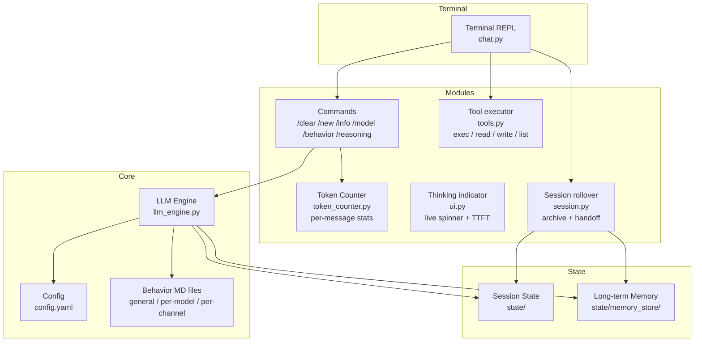

# letsClaw — Low Energy Agent Engine

A stripped-down, terminal-based agent with an interactive REPL (Read–Evaluate–Print Loop) chat.
Behavior is plain MD files — everything visible, nothing hidden.

## Philosophy Haha
- Simple: one config file, MD files for behavior
- Modular: base modules always-on, feature toggles in config
- Transparent: full source access, no black boxes
- Low energy: minimal footprint, no bloat
- Lean context: no hidden token injection — the context is your MD files + conversation, nothing else

## Quick Start

```bash
cd ~/letsClaw
pip install -r requirements.txt   # openai, pyyaml, aiohttp
python3 chat.py                   # interactive terminal chat
```

## Architecture



**Data flow:**
- **Terminal REPL:** `chat.py` is the single entry point — interactive chat with `/` commands for session control (Tab completes commands and model names), calls `llm_engine.py` for LLM chat.
- **Dotted lines = config/behavior files loaded at startup.**

## Behavior Files

Behavior is pure Markdown, layered (assembled into the system prompt at startup):

1. **General** — universal base behavior shared by all models
2. **Per-model** — tuning for a specific LLM (e.g. `models/default.md`)
3. **Per-channel** — overrides for a Discord channel (planned, with Discord)

No framework-injected boilerplate: if it's not in an MD file or the conversation, it's not sent.

## Agent Tools

The model can call tools to act on the real environment. Each turn, the agent
loop runs until the model gives a plain answer:

```
user task → model → tool_calls? → execute (⚙️ shown in terminal) → result back to model → … → final answer
```

Built-in tools: `exec` (shell), `read_file`, `write_file`, `list_dir`.
Add a tool: define a `Tool(name, description, json_schema, async_handler)`
entry in `tools.py` and list its name in `tools.allow`.

All tool I/O is truncated (`max_output_chars`) so a single call can't blow
up the context; `exec` has a timeout.

## Context Rollover

A conversation that outgrows the model's window gets rejected by the server. Rather
than silently dropping the oldest turns, letsClaw rolls the session over once it
passes `rollover_at_percent` of the active model's `context_length`:

1. the full transcript is archived to `state/sessions/<timestamp>.json`
2. the model writes a handoff — objective, what's established, what's still open —
   appended to `memory.long_term_file`
3. a fresh window starts from that handoff plus the last exchange verbatim, and is
   told where the transcript is so `read_file` can recover any detail

`rollover_mode` picks the behaviour: `auto` rolls over and says so, `ask` prompts
first, `off` only warns. **`/new` forces a rollover at any time**, in any mode — and
unlike `/clear`, which discards the conversation, `/new` files it and carries the
thread forward.

The trigger reads the server's own `usage.prompt_tokens`, so the percentage is exact.
Servers that withhold usage fall back to a local estimate, scaled up deliberately —
rolling over early costs a summary, rolling over late costs a rejected request. The
`~` in the stats line marks an estimated figure.

## Future Features

- **Semantic search** — embed past messages/sessions and search them by meaning, not just keyword match
- **Memory system** — read accumulated handoffs back in: rollover writes `state/memory_store/long_term.md`, but a new session is only seeded from its own predecessor, never from the whole history of the file
- **Discord connection** — chat via Discord, each channel with its own behavior MD file

## Config

See `config.example.yaml` for full reference with comments.

**Key sections:**
- `models` — Registry of named models. Each entry is self-contained: its own `base_url` (required), `api_key`, exact server model ID (`provider_name`), behavior file, `context_length` and sampling parameters — so two models can live on two different servers with different window sizes, and reading one entry tells you everything about that model. `default_model` picks the startup model; switch with `/model <name>` (runtime) or `./run.sh -m <name>`.
- `tools` — Agent tools: enable flag, allowlist, max tool rounds per turn, exec timeout, output truncation.
- `conversation` — History limits (`max_history_messages`), and rollover policy: `rollover_at_percent` (0 disables), `rollover_mode` (`auto`/`ask`/`off`), `sessions_dir`. The context window itself is per model, under `models`.
- `memory` — `long_term_file`, where rollover handoffs accumulate
