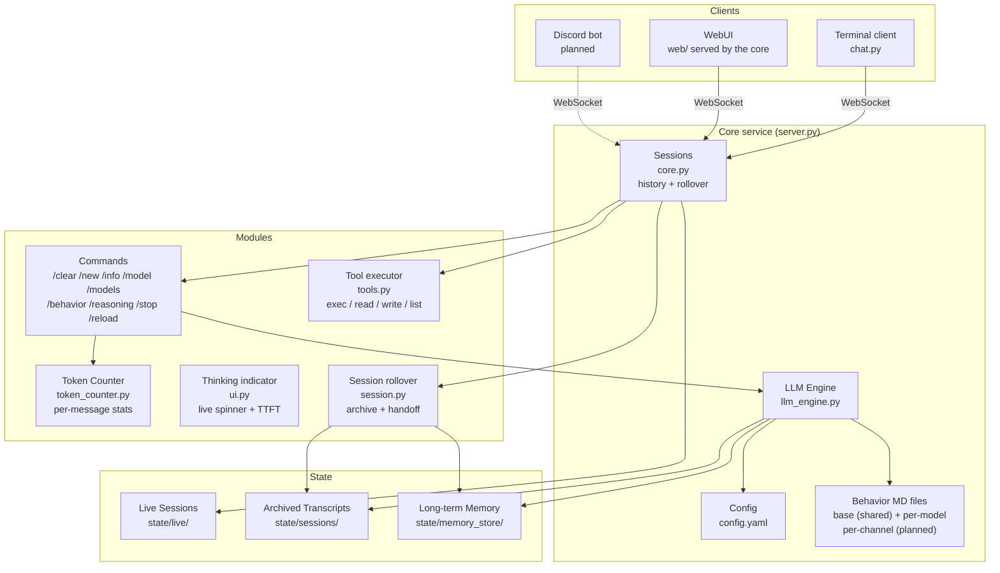
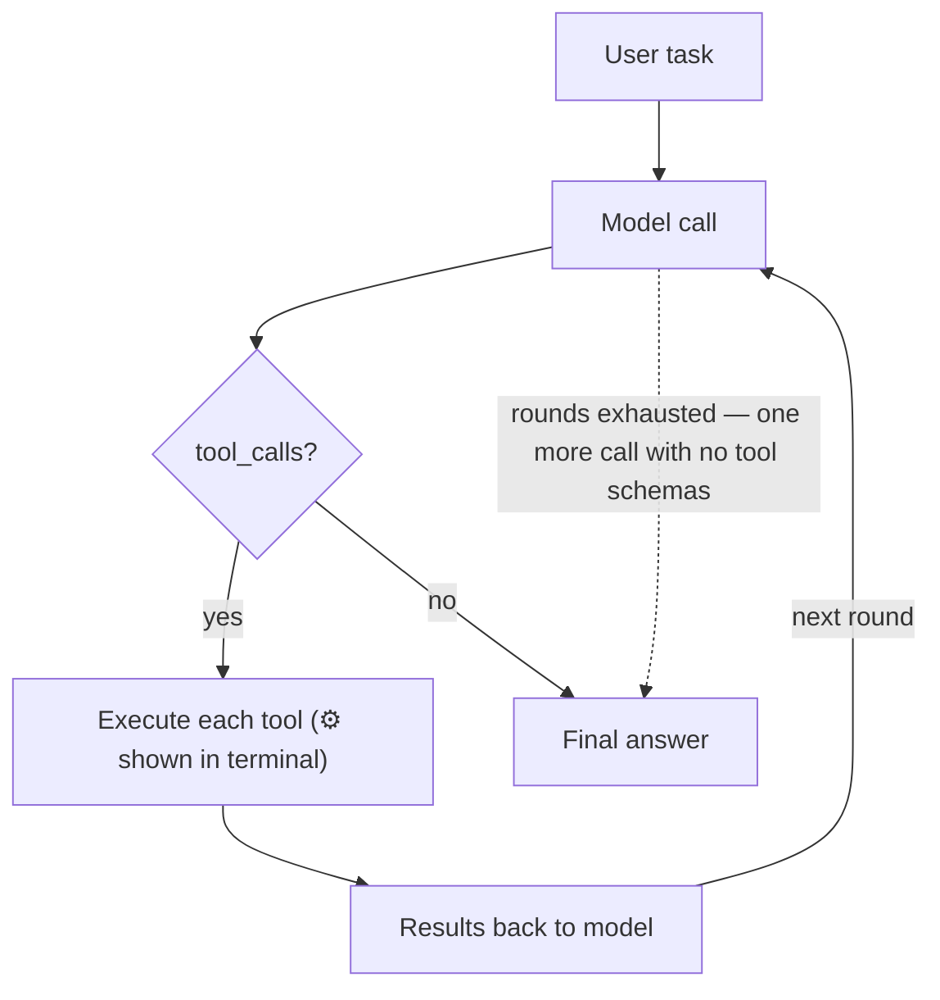

# letsClaw — Low Energy Agent Engine

A stripped-down agent: a long-lived **core service** holding the conversations, and
thin clients — a terminal REPL and a browser UI — that attach to it over a WebSocket.
Behavior is plain MD files — everything visible, nothing hidden.

## Philosophy Haha
- Simple: one config file, MD files for behavior
- Modular: base modules always-on, feature toggles in config
- Transparent: full source access, no black boxes
- Low energy: minimal footprint, no bloat
- Lean context: no hidden token injection — the context is your MD files + conversation, nothing else

## Quick Start

```bash
cd ~/letsClaw
python3 -m venv .venv
.venv/bin/pip install -r requirements.txt   # openai, pyyaml, aiohttp, tiktoken

./serve.sh                        # 1. the core — start this first, leave it running
./run.sh                          # 2. the terminal client, in another shell
```

Both pass their arguments straight through:

```bash
./serve.sh --config other.yaml --bind 0.0.0.0 --port 9000
./run.sh -s daq-notes               # attach to a session other than 'terminal'
./run.sh --url http://lab-box:8770  # a core on another machine
```

…or open <http://127.0.0.1:8770/> for the same thing in a browser. The WebUI is
served by the core itself — no build step, no `npm install`, no CDN, so it works on
a machine with no route to the internet.

The core holds the conversations; the terminal and the WebUI are just windows onto
them. It keeps running when you close them, and nothing works without it.

## Architecture



**Data flow:**
- **Core (`server.py` + `core.py`):** holds named sessions — history, model, rollover
  state, tools. Runs turns and emits events. Knows nothing about terminals.
- **Clients:** attach to a session by name over `ws://host:port/ws?session=<name>`.
  Several may attach to the same session and all see the same stream.
- **`chat.py`** is the reference client: it renders events and sends `submit` /
  `command` / `rollover_reply` / `stop`.
- **`web/`** is the same client in a browser, speaking the same protocol. Dotted
  arrows are not built yet.

## Behavior Files

The system prompt is assembled from three parts, in this order:

1. **Base behavior** — `models/base.md` (config: `behavior.base_file`), shared by every
   session and every model: the identity, the working style, and the tool notes. It is
   plain Markdown, so all of it can be tuned without a code change. A missing base file
   is a warning at core startup and an empty base — the core keeps running, the same
   behavior as a missing per-model file.
2. **Per-model behavior** — one MD file per model entry via `behavior_file`
   (e.g. `models/default.md`), layered on top of the base for tuning a specific LLM.
3. **Continued session** — after a rollover, the model-written handoff and the transcript
   path, carried in the system message.

The prompt is not frozen at startup: it is rebuilt when a session switches models, rolls
over, or takes a config reload — which is also how a changed base or model file reaches a
running session. Per-channel behavior (a Discord channel with its own MD file) is planned
with Discord.

No framework-injected boilerplate: if it's not in the files above or the conversation,
it's not sent.

## Agent Tools

The model can call tools to act on the real environment. Each turn, the agent
loop runs until the model gives a plain answer:



Built-in tools: `exec` (shell), `read_file`, `write_file`, `list_dir`.
Add a tool: define a `Tool(name, description, json_schema, async_handler)`
entry in `tools.py` and list its name in `tools.allow`.

All tool I/O is truncated (`max_output_chars`) so a single call can't blow
up the context, and the three file tools do their reading and writing off the event
loop — in the shared core one slow read would otherwise stall every session's stream.

The loop is capped at `tools.max_iterations` **rounds** per turn — a round is one model
call plus every tool call it returns, so one round can run several tools. At the cap the
core makes one final call with no tool schemas, so the model must answer in plain text.
Rollover is only evaluated *after* the loop fully drains, so a high cap means a runaway
model keeps looping — one full LLM call per round — until the server rejects an
over-window prompt or you send `/stop`.

`exec` runs in `tools.workdir` (default: the letsClaw directory itself). This matters
now that the core is a daemon: its own cwd is wherever `./serve.sh` was launched from,
which is not the shell you were sitting in, so relative paths need a stated base. Each
command gets **its own process group**, so a timeout — or a `stop`, or a core shutdown —
kills the children too instead of leaving a detached shell behind.

## Context Rollover

A conversation that outgrows the model's window gets rejected by the server. Rather
than silently dropping the oldest turns, letsClaw rolls the session over once it
passes `rollover_at_percent` of the active model's `context_length`:

1. the full transcript is archived to `state/sessions/<timestamp>.json`
2. the model writes a handoff — objective, what's established, what's still open —
   appended to `memory.long_term_file`
3. a fresh window starts from that handoff plus the last exchange verbatim, and is
   told where the transcript is so `read_file` can recover any detail

`rollover_mode` picks the behaviour: `auto` rolls over and says so, `ask` prompts
first, `off` only warns. **`/new` forces a rollover at any time**, in any mode — and
unlike `/clear`, which discards the conversation, `/new` files it and carries the
thread forward.

Two directories under `state/`, easily confused: **`state/live/` is the conversation
you are having** — rewritten as you go and reloaded at startup — while
**`state/sessions/` is the archive**, a write-once record of a window that filled up.
A rollover writes to the second and starts the first over.

The trigger reads the server's own `usage.prompt_tokens`, so the percentage is exact.
Servers that withhold usage fall back to a local estimate, scaled up deliberately —
rolling over early costs a summary, rolling over late costs a rejected request. The
`~` in the stats line marks an estimated figure.

## Token Counting

The `⚡` line after every turn carries three different numbers, and they answer
different questions:

| | |
|---|---|
| `user N + assistant N tok` | the sizes of the question and of the final answer |
| `out N tok` | **everything the model generated** this turn — the answer, the thinking, and the arguments of every tool call, summed across all rounds of the agent loop. This is what a metered endpoint bills |
| `context N/N` | how full the window is, i.e. what the *next* prompt will cost |

`out` is read from the server's `usage.completion_tokens`, and only when **every**
round of the turn reported one — a partial sum would look exact while missing rounds.
Otherwise it is a local estimate and carries a `~`, independently of the `~` on the
context figure: the prompt side and the output side can be measured or estimated
separately.

Beside it, `(N this session)` is a running total, also shown by `/info`. It is an
odometer, not a gauge: it counts what the session has ever generated, so `/clear` does
not rewind it and it comes back with the session after a restart. Deleting the session
is what resets it. A turn that produces no answer at all — the model spending its whole
budget on reasoning — still says what it spent, so the cost is never invisible.

## The Core

Start `./serve.sh` once; clients come and go around it.

| | |
|---|---|
| `GET /health` | liveness + protocol version |
| `GET /models` | configured models |
| `GET /sessions` | live sessions: model, message count, attached clients, busy |
| `POST /sessions/<name>/rename` | `{"to": "..."}` — same conversation, different name |
| `DELETE /sessions/<name>` | forget one — the history is discarded, nothing is written |
| `POST /reload` | re-read `config.yaml` into the running core; `400` and no change if it will not load |
| `WS /ws?session=<name>` | the live stream |
| `GET /` , `GET /static/*` | the WebUI, from `web/` |

When `core.token` is set every route above needs it — as `Authorization: Bearer <token>`
or `?token=` — **except** `GET /health`, which stays open so a monitor can check
liveness without holding the secret, and the WebUI itself, which holds no secrets and is
the thing that asks for the token.

**Sessions** are created on demand by name — `terminal`, `discord:#daq-ops`, whatever
a client asks for. Each has its own history, model and rollover state; `/model` in one
does not disturb another, because engines are shared per model and never closed
underneath a session still using them.

**Sessions survive a restart.** Each one is written to `state/live/` as a single JSON
file after every turn and again on a clean stop, and reloaded before the first request
is served — so the sidebar is right on its very first paint, with no client having
attached yet. The file is replaced by an atomic rename, so a `kill -9` mid-write leaves
the previous good copy rather than a truncated one, and the most a crash can cost is the
turn that was still running. A half-finished turn is never written: an unanswered tool
call or an unanswered question is unwound before saving, so what comes back is always a
conversation you could pick up.

Nothing expires. A session stays on disk until you delete it, at which point its file
goes with it; renaming moves the file, and a name you attached to but never spoke in is
never written at all. `/clear` keeps the session and empties it, which is the difference
between throwing away a conversation and throwing away the session.

### Reloading config

`POST /reload`, the `/reload` command, or **♻️ reload** in the WebUI re-reads
`config.yaml` and applies it to everything already running — no restart, no dropped
socket, no interrupted turn.

**Nothing is committed until the new file parses and produces a working engine for every
model in it.** A half-finished edit — the normal state of a file open in an editor —
comes back as `400` with the parser's own complaint, and the core carries on exactly as
it was. Building the engines *is* the validation: it is the same code path a real turn
takes, so it catches a missing `base_url` that a schema check would wave through.

Three tiers:

| | |
|---|---|
| **Live already** | `core.token`, the `state/` paths, and the model list `GET /models` serves — these are read per request, so the reload is what updates the file, not what plumbs it through |
| **Reload picks it up** | every model's `context_length`, `base_url`, `temperature`, `max_tokens`, `top_p` and `provider_name`; added and removed models; behavior files; the tool allowlist and `exec_timeout`; `max_iterations`; every `conversation.*` setting; `logging.level` |
| **Restart-only** | `core.bind` and `core.port` — the socket is already bound, and rebinding drops every client, which is the thing being avoided — and `logging.file` |

An idle session takes the change immediately; one mid-turn takes it the moment that turn
ends, and the reply says how many of each. **A setting a session changed for itself is
left alone** — the test is whether it still holds what the *old* config said, so a
session that auto-disabled its own rollover is not dragged back into the loop it just
escaped. A model deleted from the config does not move the sessions using it: they keep
the engine they have, which still works, and are told that `/model` can no longer return
to it.

The reply names what moved, key by key
(`models.qwen38-local.context_length: 100000 -> 128000`), so a reload says what it did
rather than just that it happened.

**Because the core outlives its clients**, closing the terminal mid-answer does not
stop the turn. Reattach and the output you missed is replayed, then the conversation
carries on. One turn at a time per session: a second submit is refused with `busy`
rather than silently queued behind a context its sender never saw.

**Events** (core → client): `hello` `turn_start` `text` `reasoning` `tool_call`
`tool_result` `stats` `turn_end` `rollover_start` `rollover_ask` `rollover_done`
`session_state` `notice` `busy` `error` `response` `pong`.
**Messages** (client → core): `submit` `command` `rollover_reply` `stop` `ping`.

There is no attach message: the session name is a query parameter on the socket, and
`hello` — the first event on every connection — carries the snapshot back. So attaching
is a connection, not a handshake, and reconnecting is the same operation as connecting.

`tool_call` is emitted *before* the tool runs, so a slow `exec` is visible instead of
silent. Read-only commands (`/info`, `/behavior`, bare `/model` and `/models`) come back as a
`response` to the asking client only, not broadcast to everyone attached.

> **Security.** Tools are unconfined by design: `exec` runs shell commands and
> `read_file`/`write_file` reach any path this process can. Anyone who can open a
> WebSocket to the core can therefore run commands on this machine. Keep `core.bind`
> on loopback, or set `core.token`, and only connect frontends you control.

## Terminal Client

`./run.sh` is a thin client: it renders events and sends `submit` / `command` /
`rollover_reply` / `stop`, and holds no conversation state of its own. Two flags —
`-s/--session` picks the session name (default `terminal`), `--url` points at a core
somewhere other than the `core.bind`/`core.port` in the config.

| command | |
|---|---|
| `/clear` | discard the conversation and start over |
| `/new` | archive the session, keep the objective, start fresh |
| `/model` , `/model <name>` | list the configured models, or switch this session to one |
| `/models` | the model list on its own |
| `/info` | recent history, context usage, output total |
| `/behavior` | print the loaded behavior file |
| `/reasoning` | toggle live display of the model's thinking |
| `/stop` | interrupt the turn in progress |
| `/reload` | re-read `config.yaml` into the running core |
| `/quit` , `/exit` | leave — the core keeps running, and so does the turn |

**Tab completes** commands, and model names after `/model `. The completion list prints
each command with its description rather than a bare column of names. One gap to be aware
of: the completer's list (`COMMANDS` in `chat.py`) does not include `/models`, so `/models`
works when typed but is never suggested. `/quit`, `/exit`
and `/reasoning` are handled in the terminal — they change this window, not the
conversation — so they never reach the core; everything else is a `command` message and
comes back as a `response` to this client alone.

Readline needs a blocking read, so input runs on its own thread and is fed to the event
loop through a queue: the prompt stays editable while an answer streams in above it.

## WebUI

<http://127.0.0.1:8770/> — three static files (`index.html`, `app.js`, `style.css`),
served by the core. No framework, no build step, no CDN: the core often sits on an
isolated lab network, so everything the page needs comes from the core itself. Note the
`/static/` route serves the whole `web/` directory, so the test helpers (`test_md.mjs`,
`browser_test.py`, `shot.py`) are also reachable under it — harmless while the core is
loopback-bound, but something to keep in mind before exposing the port.

**The sidebar** on the left is the session list, rebuilt from `GET /sessions` rather
than tracked locally, so a session someone started in another window shows up here
too. Each row carries its message count, a dot while a turn is running, and `✎` and
`✕` on hover; `+` opens a name field, and switching to a name that does not exist yet
*is* how you create it — sessions spring into existence on attach. `☰` hides the list,
and `?session=<name>` still picks one from the URL.

`✎` (or a double-click on the name) **renames in place** — same session object, same
conversation, same socket; only the label moves. Anyone attached is told over their
own socket and follows it, URL included, so a reload lands on the same conversation.
Blank names, names containing `/`, and names longer than 64 characters are refused
(400), as is a name already in use (409). Like delete, it is refused while a turn is
running: every event is stamped with the session's name, so a rename mid-turn would
split one turn's output across two names. Transcripts already archived under `state/`
keep the old name in their filename — they record what the session was called then.

`✕` **discards the conversation and writes nothing**, so it asks first and tells you
how many messages are about to go. It is refused (409) while a turn is running, since
dropping the session out of the registry would not stop the turn. Anyone attached to a
deleted session keeps their socket: they get a notice, and their next message
transparently lands on a fresh, empty session of the same name. Past rollover
transcripts under `state/` are archives of their own and are left alone.

Everything the terminal client can
do is there: streaming answers with markdown and copyable code blocks, tool calls
appearing *before* they run, the context gauge with the rollover threshold marked,
the `🧠 think` toggle, the rollover prompt with its live countdown, and the same
slash commands with `/`-triggered autocomplete.

Two things worth knowing about how it behaves:

- **Nothing is rendered optimistically.** Your own message appears when the core
  echoes it back in `turn_start`, so every client attached to a session shows the
  same transcript in the same order — including yours.
- **It reconnects on its own** and replays the session history on attach, so closing
  the laptop mid-answer loses nothing.

If `core.token` is set the page asks for it before connecting. The page itself is
served unauthenticated on purpose: it holds no secrets, and it is the thing that
asks for the token.

**Tests.** `node web/test_md.mjs` exercises the markdown renderer headlessly.
`.venv/bin/python web/browser_test.py` drives real headless Chrome over the DevTools
Protocol against a running core — no Selenium, no Playwright, nothing to install —
and asserts against the live DOM, so a JS error that stops the render fails a check
rather than passing quietly. `web/shot.py <session> [out.png] [dark|light]` takes a
screenshot; both themes follow `prefers-color-scheme`.

## Future Features

- **Semantic search** — embed past messages/sessions and search them by meaning, not just keyword match
- **Memory system** — read accumulated handoffs back in: rollover writes `state/memory_store/long_term.md`, but a new session is only seeded from its own predecessor, never from the whole history of the file
- **Discord connection** — chat via Discord, each channel with its own behavior MD file

## Config

See `config.example.yaml` for full reference with comments.

**Key sections:**
- `models` — Registry of named models. Each entry is self-contained: its own `base_url` (required), `api_key`, exact server model ID (`provider_name`), behavior file, `context_length` and sampling parameters — so two models can live on two different servers with different window sizes, and reading one entry tells you everything about that model. `default_model` picks the model a new session starts on; `/model <name>` switches one session at runtime without disturbing the others.
- `core` — The service itself: `bind` (loopback by default — see the security note above), `port` (the WebUI is on the same one), and `token`, an optional shared secret. `--bind` / `--port` / `--config` on `./serve.sh` override the first three.
- `tools` — Agent tools: enable flag, allowlist, `max_iterations` (tool rounds per turn before a final answer is forced), `exec_timeout`, `max_output_chars`, and `workdir` — the base directory `exec` runs in and relative paths resolve against, defaulting to the letsClaw directory.
- `conversation` — `max_history_messages`, a backstop that trims the oldest messages (never opening on an orphaned tool result) and only applies on turns where no rollover happened — rollover is the real mechanism, this just stops an unbounded session with rollover switched off. Then rollover policy: `rollover_at_percent` (0 disables), `rollover_mode` (`auto`/`ask`/`off`), `prompt_timeout` (seconds to wait for an answer in `ask` mode before keeping the session). Two directories: `live_dir` holds the running conversations and is reloaded at startup, `sessions_dir` holds archived transcripts. The context window itself is per model, under `models`.
- `memory` — `long_term_file`, where rollover handoffs accumulate
- `logging` — `level` and `file`; the core logs there and to stderr, and every session event of consequence (restore, rename, delete, rollover, a dropped tool-call turn) is one line in it.
